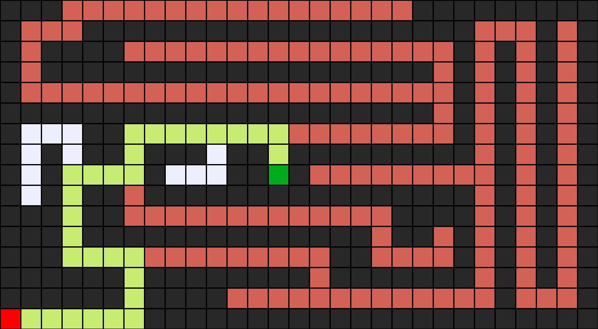

# Maze-Solver
A python program that can solve mazes and also create visual images to the solutions

## Usage
```bash
python maze.py mazes/maze2.txt
```



The above image has been generated using Pillow. The Algorithm used for solving the maze - DFS

- The dark red square at the bottom is the initial state and the dark green square is the goal state
- The image shows the soltion path using yellow squares
- The light red sqaure shows all the explored paths
